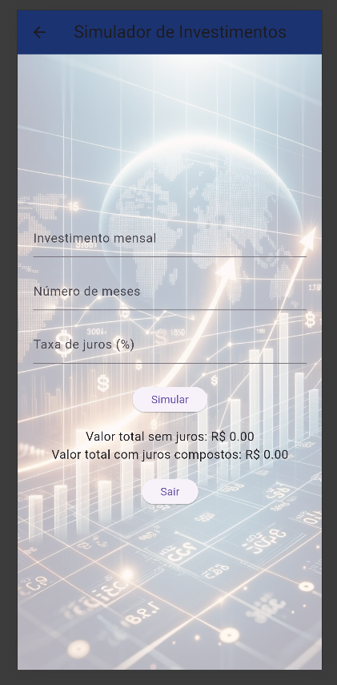
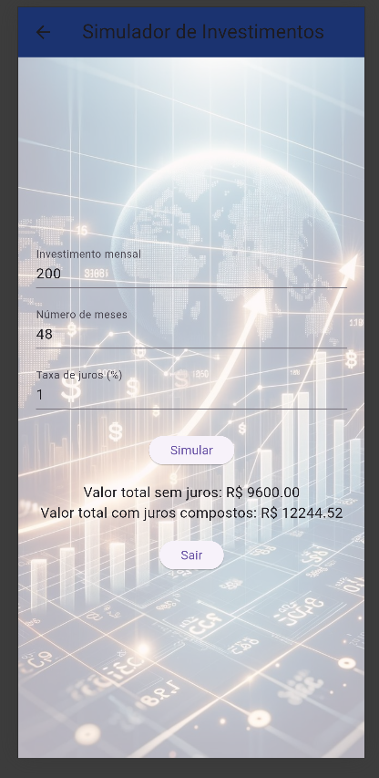
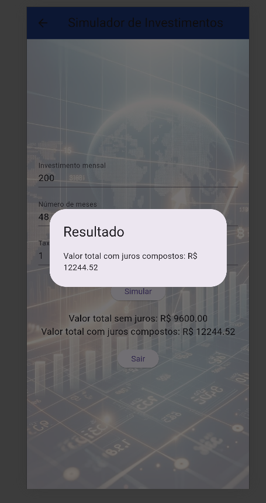

# Investimento2026

## Descrição
Este aplicativo calcula o valor de um investimento com base nos dados informados pelo usuário.

## Protótipo no Figma
[Clique aqui para acessar](https://www.figma.com/design/50XTdfZm4HTILxXsLdPfrE/Investimento?m=dev&t=Y2Gmsiq9jUTiWI6S-1)

## Prints do funcionamento

| Wireframes01 | Wireframes02 | Wireframes03 |
|--------------|--------------|--------------|
|  |  |  |

## Tecnologias utilizadas
- Flutter
- Dart

## Como executar o projeto?
1. Clone este repositório
2. Abra no VS Code
3. Execute o comando:
flutter run
